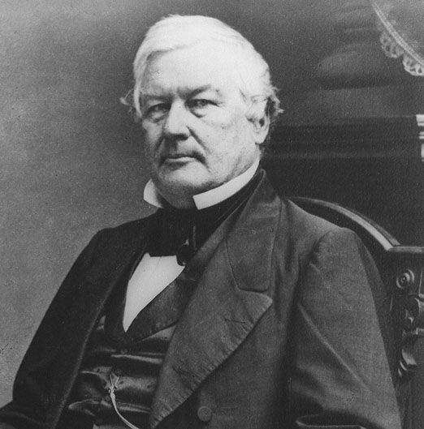

# Experimentation with golang

To run:

```
./millard
```

# What's with the name?

Millard Fillmore (1800-1874) was 13th presidenet, the last Whig president, and the last president to not be either a Democrat or a Republican.


